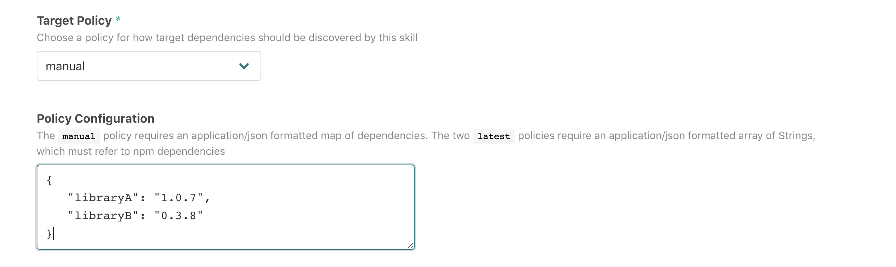

# `@atomist/update-npm-dependencies`

<!---atomist-skill-readme:start--->

Keep track of all versions of npm dependencies found within package.json files across your Repositories.

# What it's useful for

As you scale up the number of Repositories containing package.json files, it is natural to accumulate
dependencies on many different versions of the same library.  This skill tracks those different versions, 
and offers three different target policies to help you reduce version "entropy".

1.  **Latest Used** - of all your versions in use, teams should be moving towards the latest of these.  This is a 
    useful policy for internal libraries.
2.  **Latest Available** - projects should be use the latest version available on npmjs.org.  This is great for keeping
    up with bug fixes in open-source libraries.
3.  **Manual** - use a target version specified directly in this skill's configuration.  This can be useful to guide
    your library's users on the current "best" version of a library.  However, the effect is very similar
    to a manually updated **Latest Used** target.

# Before you get started

Connect and configure these integrations:

1. **GitHub**
2. **Slack** (optional)

This skill creates watches Pushes to git, and creates Pull Requests.  Accordingly, users will need to configure 
the GitHub integration before the skill can be enabled.  

We've also added some optional Slack Commands to this skill.  With Slack enabled, a user can ask the Slack bot
whether a Repository is out of sync with any npm version targets.

# How to configure

Each configuration of this skill will represent a target policy for a set of npm dependencies.  For example, if `libaryA` 
should use `1.0.7`, and `libraryB` should use `0.3.8`, then you can select a `Manual` target with the value:

```
{
   "libraryA": "1.0.7",
   "libraryB": "0.3.8"
}
```



We've tried to make it easy to just copy and paste some a JSON snippet out of an existing package.json file.

Instead of having to update a manual configuration, choosing `latest available` or `latest used` requires only that
you specify the names of libraries that should conform to this policy.  For this, we use an `application/json` encoded 
string array like `["libraryA", "libraryB"]`.

~[screenshot2](docs/image/screenshot2.png)

As with many Atomist skills, this skill has a `RepoFilter`.  So you can start by applying the skill to a few projects 
and then let it evolve to a best practice that you share.  This skill is particularly well suited to being applied to
"all" repositories.

## How to use this skill

You can enable this skill _without_ configuring any policy.  In this mode, the skill will track all versions of 
npm libaries used but will not raise any Pull Requests.  It's in "recording" mode but won't create any
Pull Requests.  This mode is still useful:

1.  Atomist provides a graphql API to query for all projects using a library, or a
    particular version of that library.  We call these "drift" queries.
2.  If you have Slack enabled, typing `@atomist npm fingerprints --slug=org/repo`, will 
    show all versions used by a particular repo.  Typing 
    `@atomist npm update --slug=org/repo --dependency='{"libraryA":"1.0.8"}'` will raise
    Pull request, whether there is a current policy set or not.
    
This skill is _most_ useful when you configure one of the policies.  You might already see
version drift across your node projects; however, even if that's not the case, an "actionable" signal
like a Pull Request, is a nice productivity boost for even a small set of projects.  

<!---atomist-skill-readme:end--->

---

Created by [Atomist][atomist].
Need Help?  [Join our Slack workspace][slack].

[atomist]: https://atomist.com/ (Atomist - How Teams Deliver Software)
[slack]: https://join.atomist.com/ (Atomist Community Slack) 
