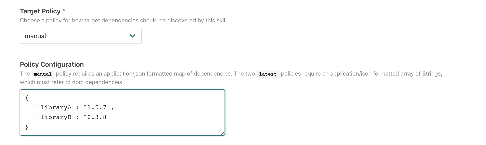
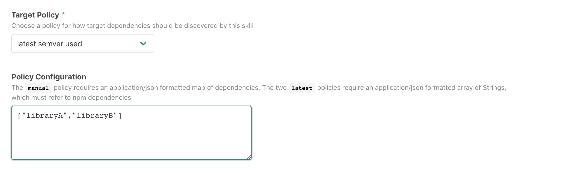
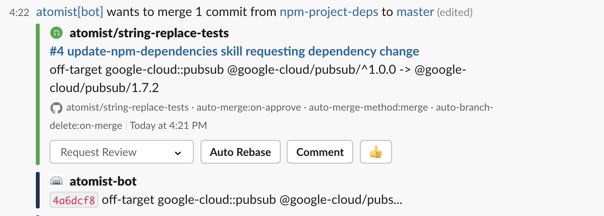
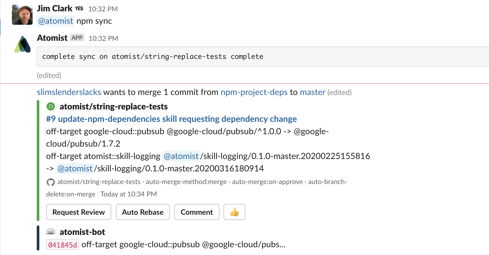

# `@atomist/update-npm-dependencies`

<!---atomist-skill-readme:start--->

Keep track of all versions of npm dependencies found within package.json files across your Repositories.

# What it's useful for

Track all the different versions of npm libraries references in package.json files across your repositories.  
Automatically raise Pull Requests when a version does not conform to a selected "target" version.  Choose
from three different targets:

1.  **Latest Used** - select the latest version found in one of your repositories.
2.  **Latest Available** - select the latest version found at [npmjs.com](https://npmjs.com).
3.  **Manual** - select a target version in a skill configuration

# Before you get started

Connect and configure these integrations:

1. **GitHub**
2. **Slack** (optional)

This skill raises pull requests. The GitHub integration must be configured in order to use this skill. At least one repository must be selected.

When the optional Slack integration is enabled, users can interact with this skill directly from Slack.

# How to configure

1.  You can enable this skill without configuring any target versions.  In this mode, the skill will collect
    data your library versions, but will take no action.  Simply select the set of
    repositories that should be scanned.
    

    
2.  Choose a target version policy to start raising Pull Requests.

A `manual` policy requires that you specify both the library and the version.



The other two policies require only the names of the libraries that should be kept up to date.



---

## How to use `Update Npm Dependencies`

1.  **Enable this skill** by selecting a set of Repositories that should be scanned for package.json files.

2.  The skill will run on any new Pushes to selected repositories.

3.  **Add a Target Policy**

    Subsequent Pushes will trigger Pull Requests for npm libraries that are off-target.
    
    
   

4.  **Run a version sync from Slack**

    Interactively check that a Repo is in sync with current policies. 
    
    ```
    @atomist npm sync
    @atomist npm sync --slug=org/repo
    ```

    
    
    (you do not need to specify a `--slug` parameter if your Slack channel is linked to a Repo)
    
    This is useful when you want to generate a Pull Request without having to wait for a Push to occur.

<!---atomist-skill-readme:end--->

---

Created by [Atomist][atomist].
Need Help?  [Join our Slack workspace][slack].

[atomist]: https://atomist.com/ (Atomist - How Teams Deliver Software)
[slack]: https://join.atomist.com/ (Atomist Community Slack) 
